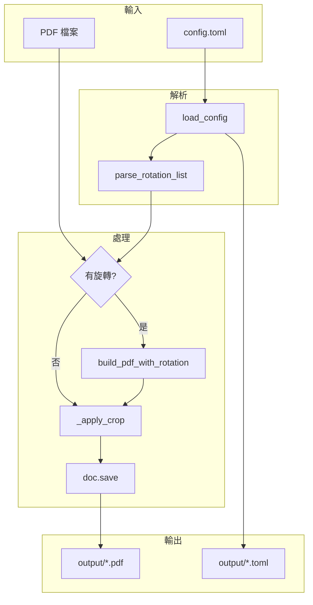

# ebook-crop 技術分析文件

本文檔提供 ebook-crop 專案的深入技術分析，供後續開發參考。

---

## 1. 專案概述

### 1.1 目標與定位

ebook-crop 是一個 PDF 電子書版面優化工具，主要解決：

- **留白過多**：掃描或轉檔的 PDF 常有大量邊界留白，導致閱讀時字體被迫縮小
- **頁面傾斜**：掃描電子書可能出現頁面角度不正確的問題，支援頁面旋轉任意角度修正
- **設定追溯**：處理後保留裁切設定，便於日後重現或調整

### 1.2 技術棧

| 項目 | 技術 |
|------|------|
| 語言 | Python 3.10+ |
| PDF 處理 | PyMuPDF (fitz) 1.24+ |
| 設定檔 | TOML (tomli) |
| 終端機輸出 | Rich 13.0+ |
| 測試框架 | pytest 8.0+、pytest-cov 5.0+ |
| 環境管理 | uv |
| 建置 | hatchling |

---

## 2. 架構設計

### 2.1 模組結構

```
ebook_crop/
├── __init__.py    # 版本號
├── main.py        # 進入點，轉發至 cli.main
├── cli.py         # argparse、main()
├── config.py      # load_config、parse_rotation_list、format_rotation_display
├── rotation.py    # build_pdf_with_rotation、_get_rotated_page_rect
├── console.py     # 終端機輸出（彩色輸出、進度條、詳細/靜默模式）
├── crop.py        # _apply_crop、crop_pdf
└── utils.py       # _safe_print、save_config_to_output
```

模組已拆分，各職責分離。

### 2.2 資料流



### 2.3 處理順序

1. **載入設定**：讀取 config.toml
2. **開啟 PDF**：取得總頁數（用於解析 `pages="3-0"`）
3. **旋轉**（若有）：先執行，因裁切座標相對於未旋轉頁面
4. **裁切**：依 margins 與 pages 設定套用 cropbox
5. **儲存**：輸出 PDF 與對應 .toml

---

## 3. 核心元件分析

### 3.1 設定系統

#### 3.1.1 設定檔結構

```toml
[margins]     # 留白裁切（點，1 inch = 72 pt）
[pages]       # 裁切頁數範圍
[[rotation]]  # 頁面旋轉（可多筆）
```

#### 3.1.2 載入邏輯

- `config.load_config()`：讀取 TOML，找不到時提示複製 config-sample.toml
- 路徑：預設 `config.toml`，可透過 `-c` 指定

#### 3.1.3 旋轉設定解析 (`parse_rotation_list`)

| 格式 | 範例 | 說明 |
|------|------|------|
| 單頁 | `page = 3` | 第 3 頁 |
| 逗號 | `pages = "1,3,5"` | 指定多頁 |
| 陣列 | `pages = [1, 3, 5]` | 同上 |
| 範圍 | `pages = "3-9"` | 第 3 至 9 頁 |
| 至最後 | `pages = "3-0"` | 第 3 頁至最後一頁（需 total_pages） |
| 全文件 | `pages = "0-0"` | 第 1 頁至最後一頁 |
| 跳頁 | `skip = 1` | 每隔 1 頁（3, 5, 7, 9） |

**重要**：`pages="3-0"` 需在開啟 PDF 後才能解析，因需 `total_pages`。

### 3.2 旋轉引擎 (`rotation.build_pdf_with_rotation`)

#### 3.2.1 策略：分段處理

為避免每頁都用 `show_pdf_page` 重建，採用分段：

1. **第一個旋轉頁之前**：`insert_pdf` 批次複製
2. **旋轉頁**：`show_pdf_page` 重建（支援任意角度）
3. **旋轉頁之間**：`insert_pdf` 複製
4. **最後旋轉頁之後**：`insert_pdf` 複製

#### 3.2.2 PyMuPDF API 使用

- `show_pdf_page(rect, docsrc, pno, rotate=angle)`：任意角度旋轉
- `insert_pdf(docsrc, from_page, to_page)`：複製頁面範圍
- 旋轉方向：使用者 正值=順時針，程式內對 PyMuPDF 傳 `-angle`

#### 3.2.3 頁面尺寸

- 90°、270°：寬高對調 (`_get_rotated_page_rect`)
- 其他角度：沿用來源尺寸，`keep_proportion=True` 置中縮放

### 3.3 裁切引擎 (`_apply_crop`)

- 使用 `page.set_cropbox(rect)` 設定可見區域
- 座標為未旋轉頁面空間
- `start_page`、`end_page` 為 1-based，0 或 1 表示從封面開始

### 3.4 資源管理

- `crop.crop_pdf` 使用 `try/finally` 確保文件關閉
- 有旋轉時：關閉 `src_doc`，保留 `new_doc` 供裁切與儲存
- `doc.save(..., garbage=1, deflate=True)`：garbage=1 平衡速度與檔案大小

---

## 4. CLI 介面

### 4.1 參數

| 參數 | 說明 | 預設 |
|------|------|------|
| `input` | 輸入 PDF（可省略） | - |
| `-o, --output` | 輸出路徑 | 輸入檔名_cropped.pdf |
| `-c, --config` | 設定檔 | config.toml |
| `-i, --input-dir` | 批次輸入目錄 | input |
| `-d, --output-dir` | 批次輸出目錄 | output |
| `--version` | 顯示目前版本 | - |
| `-v, --verbose` | 詳細模式 | - |
| `-q, --quiet` | 靜默模式 | - |
| `--dry-run` | 預覽模式，不實際處理 | - |

### 4.2 執行模式

- **批次模式**：無 input 與 output 時，處理 `input/` 內所有 PDF
- **單檔模式**：指定 input，可選 output

### 4.3 輸出行為

- 每份 PDF 處理後，將使用的 config 複製為 `檔名.toml` 至輸出目錄（`utils.save_config_to_output`）
- `utils._safe_print` 處理 Windows 主控台 Unicode 編碼問題
- `sys.stdout.flush()` 確保「完成！」即時顯示

---

## 5. 測試

### 5.1 測試結構

```
tests/
├── conftest.py          # 共用 fixtures（tmp_path、樣本 PDF 路徑、設定檔生成）
├── test_config.py       # Config 單元測試（53 個）
├── test_rotation.py     # Rotation 單元測試（15 個）
├── test_crop.py         # Crop 單元測試（11 個）
├── test_integration.py  # 整合測試（12 個）
├── test_edge_cases.py   # 邊界測試（17 個）
└── generate_samples.py  # 樣本 PDF 生成腳本
```

### 5.2 測試 Fixtures

- **conftest.py**：提供共用 fixtures，包含臨時目錄、樣本 PDF 路徑、測試設定檔生成等

### 5.3 樣本 PDF

測試用樣本 PDF 與設定檔存放於 `test/input/`（加入 Git）：

| 檔案 | 說明 |
|------|------|
| `basic_5page.pdf` | 基本 5 頁 PDF |
| `single_page.pdf` | 單頁 PDF |
| `ten_pages.pdf` | 10 頁 PDF |
| `landscape.pdf` | 橫向 PDF |
| `small_page.pdf` | 小頁面 PDF |
| `test_basic.toml` | 基本測試設定 |
| `test_rotation.toml` | 旋轉測試設定 |
| `test_units.toml` | 單位測試設定 |
| `test_zero_margins.toml` | 零留白測試設定 |

### 5.4 覆蓋率

| 模組 | 覆蓋率 |
|------|--------|
| config.py | 97% |
| crop.py | 98% |
| rotation.py | 100% |

### 5.5 執行測試

```bash
uv run pytest --cov -v
```

CI 於 Python 3.10/3.11/3.12 執行測試含覆蓋率報告。

---

## 6. 依賴關係

### 6.1 直接依賴

```
pymupdf>=1.24.0   # PDF 讀寫、旋轉、裁切
tomli>=2.0.0      # TOML 解析（Python 3.11+ 可用 stdlib tomllib）
rich>=13.0.0      # 終端機彩色輸出、進度條
```

### 6.2 開發依賴

```
pytest>=8.0.0     # 測試框架
pytest-cov>=5.0.0 # 覆蓋率報告
```

### 6.3 PyMuPDF 關鍵 API

| 用途 | API |
|------|-----|
| 開啟/儲存 | `fitz.open()`, `doc.save()` |
| 裁切 | `page.set_cropbox(rect)` |
| 旋轉（任意角度） | `page.show_pdf_page(rect, src, pno, rotate=angle)` |
| 複製頁面 | `doc.insert_pdf(src, from_page, to_page)` |
| 頁面尺寸 | `page.rect`, `fitz.Rect()` |

---

## 7. 擴充與改進建議

### 7.1 模組化重構

已完成拆分，結構如下：

```
ebook_crop/
├── __init__.py
├── main.py        # 進入點
├── cli.py         # argparse、main()
├── config.py      # load_config、parse_rotation_list、format_rotation_display
├── console.py     # 終端機輸出（彩色輸出、進度條、詳細/靜默模式）
├── rotation.py    # build_pdf_with_rotation、_get_rotated_page_rect
├── crop.py        # _apply_crop、crop_pdf
└── utils.py       # _safe_print、save_config_to_output
```

### 7.2 功能藍圖

依開發階段劃分的詳細功能規劃，請見 [ROADMAP.md](ROADMAP.md)。

**階段一（品質與測試基礎）已於 v1.5.0 完成**，包括 pytest 框架（108 個測試）、config/rotation/crop 單元測試、整合測試、邊界測試、CI 測試流程與程式碼覆蓋率。

**階段二（使用者體驗改善）已於 v1.4.0 完成**，包括 `--version` 旗標、Rich 進度條、詳細/靜默模式、預覽模式、留白單位支援、設定檔驗證與彩色輸出。

主要發展方向包括：

- ~~**測試基礎**~~：已完成（v1.5.0）
- ~~**體驗改善**~~：已完成（v1.4.0）
- **核心擴充**：自動偵測留白、每頁不同留白、奇偶頁留白、裁切預覽
- **進階功能**：平行批次處理、遞迴目錄、設定檔配置系統
- **生態系**：PyPI 發布工作流程、GUI 前端、Docker 映像

### 7.3 效能考量

- 大檔案（300+ 頁）旋轉多頁時，`show_pdf_page` 較耗時
- `garbage=1` 已用於平衡速度與檔案大小
- 可考慮 `garbage` 設為 config 選項（見 ROADMAP 階段三）

---

## 8. 開發規範

### 8.1 Git Commit

- 規範：AngularJS Git Commit Message Conventions
- 語言：英文或繁體中文
- 詳見：`CONTRIBUTING.md`（English）、`CONTRIBUTING-CHT.md`（繁體中文）

### 8.2 專案慣例

- 頁碼：對外（config、顯示）為 1-based，內部為 0-based
- 角度：正值=順時針、負值=逆時針
- 單位：留白使用 PDF 點（points），1 inch = 72 pt

---

## 9. 檔案清單

| 路徑 | 說明 |
|------|------|
| `pyproject.toml` | 專案設定、依賴、entry point |
| `config-sample.toml` | 設定範本 |
| `ebook_crop/__init__.py` | 版本號 |
| `ebook_crop/main.py` | 進入點 |
| `ebook_crop/cli.py` | 命令列介面 |
| `ebook_crop/config.py` | 設定載入與解析 |
| `ebook_crop/rotation.py` | 頁面旋轉 |
| `ebook_crop/crop.py` | 留白裁切 |
| `ebook_crop/console.py` | 終端機輸出（彩色輸出、進度條） |
| `ebook_crop/utils.py` | 共用工具 |
| `CONTRIBUTING.md` | Commit 規範（English） |
| `CONTRIBUTING-CHT.md` | Commit 規範（繁體中文） |
| `CLAUDE.md` | Claude Code 輔助指引 |
| `tests/conftest.py` | 測試共用 fixtures |
| `tests/test_config.py` | Config 單元測試（53 個） |
| `tests/test_rotation.py` | Rotation 單元測試（15 個） |
| `tests/test_crop.py` | Crop 單元測試（11 個） |
| `tests/test_integration.py` | 整合測試（12 個） |
| `tests/test_edge_cases.py` | 邊界測試（17 個） |
| `tests/generate_samples.py` | 樣本 PDF 生成腳本 |
| `test/input/` | 樣本 PDF 與測試設定檔 |
| `.gitignore` | 排除 input/、output/、config.toml、.venv 等 |

---

## 10. 版本資訊

- 專案版本：1.5.0
- Python：3.10+
- 文件更新：2026-03-05
