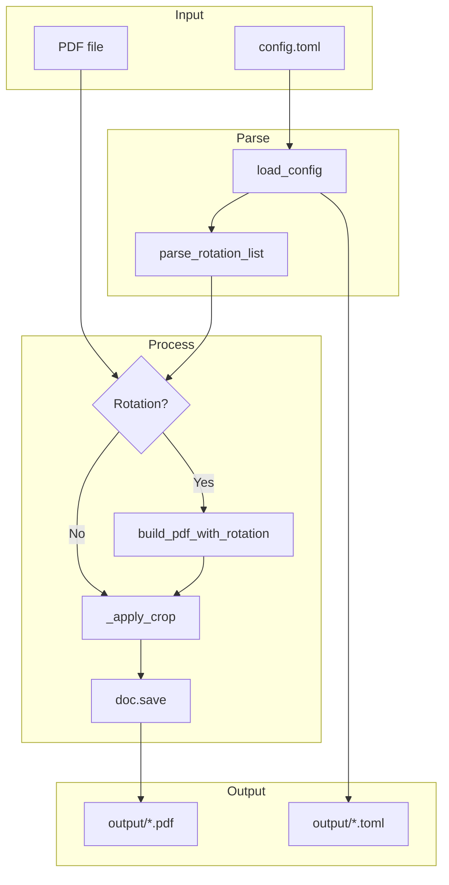

# ebook-crop Technical Analysis

This document provides in-depth technical analysis of the ebook-crop project for future development reference.

---

## 1. Project Overview

### 1.1 Goals and Positioning

ebook-crop is a PDF ebook layout optimization tool that addresses:

- **Excessive margins**: Scanned or converted PDFs often have large boundary margins, forcing smaller font display when reading
- **Page tilt**: Scanned ebooks may have incorrect page angles; supports arbitrary-angle page rotation for correction
- **Configuration traceability**: Preserves crop settings after processing for future reproduction or adjustment

### 1.2 Technology Stack

| Item | Technology |
|------|------------|
| Language | Python 3.10+ |
| PDF Processing | PyMuPDF (fitz) 1.24+ |
| Configuration | TOML (tomli) |
| Terminal UI | Rich 13.0+ |
| Testing | pytest 8.0+, pytest-cov 5.0+ |
| Environment | uv |
| Build | hatchling |

---

## 2. Architecture Design

### 2.1 Module Structure

```
ebook_crop/
├── __init__.py    # Version
├── main.py        # Entry point, forwards to cli.main
├── cli.py         # argparse, main()
├── config.py      # load_config, parse_rotation_list, format_rotation_display
├── rotation.py    # build_pdf_with_rotation, _get_rotated_page_rect
├── crop.py        # _apply_crop, crop_pdf
├── console.py     # Colored output, progress bar, verbosity control
└── utils.py       # _safe_print, save_config_to_output
```

Modules are separated with clear responsibilities.

### 2.2 Data Flow



### 2.3 Processing Order

1. **Load config**: Read config.toml
2. **Open PDF**: Get total page count (for parsing `pages="3-0"`)
3. **Rotation** (if any): Execute first, since crop coordinates are relative to unrotated pages
4. **Crop**: Apply cropbox per margins and pages settings
5. **Save**: Output PDF and corresponding .toml

---

## 3. Core Components

### 3.1 Configuration System

#### 3.1.1 Config Structure

```toml
[margins]     # Margin crop (points, 1 inch = 72 pt)
[pages]       # Crop page range
[[rotation]]  # Page rotation (multiple entries allowed)
```

#### 3.1.2 Load Logic

- `config.load_config()`: Reads TOML, prompts to copy config-sample.toml if not found
- Path: Default `config.toml`, overridable via `-c`

#### 3.1.3 Rotation Config Parsing (`parse_rotation_list`)

| Format | Example | Description |
|--------|---------|-------------|
| Single page | `page = 3` | Page 3 |
| Comma-separated | `pages = "1,3,5"` | Multiple pages |
| Array | `pages = [1, 3, 5]` | Same as above |
| Range | `pages = "3-9"` | Pages 3 to 9 |
| To last | `pages = "3-0"` | Page 3 to last (requires total_pages) |
| Full document | `pages = "0-0"` | Page 1 to last |
| Skip | `skip = 1` | Every other page (3, 5, 7, 9) |

**Note**: `pages="3-0"` requires PDF to be opened first for `total_pages`.

### 3.2 Rotation Engine (`rotation.build_pdf_with_rotation`)

#### 3.2.1 Strategy: Segmented Processing

To avoid rebuilding every page with `show_pdf_page`, uses segments:

1. **Before first rotated page**: `insert_pdf` batch copy
2. **Rotated pages**: `show_pdf_page` rebuild (supports arbitrary angles)
3. **Between rotated pages**: `insert_pdf` copy
4. **After last rotated page**: `insert_pdf` copy

#### 3.2.2 PyMuPDF API Usage

- `show_pdf_page(rect, docsrc, pno, rotate=angle)`: Arbitrary angle rotation
- `insert_pdf(docsrc, from_page, to_page)`: Copy page range
- Rotation direction: User positive=clockwise, internally passes `-angle` to PyMuPDF

#### 3.2.3 Page Dimensions

- 90°, 270°: Width/height swapped (`_get_rotated_page_rect`)
- Other angles: Keep source dimensions, `keep_proportion=True` for centered scaling

### 3.3 Crop Engine (`_apply_crop`)

- Uses `page.set_cropbox(rect)` to set visible area
- Coordinates in unrotated page space
- `start_page`, `end_page` are 1-based; 0 or 1 means from cover

### 3.4 Resource Management

- `crop.crop_pdf` uses `try/finally` to ensure document closure
- With rotation: Close `src_doc`, keep `new_doc` for crop and save
- `doc.save(..., garbage=1, deflate=True)`: garbage=1 balances speed and file size

---

## 4. CLI Interface

### 4.1 Parameters

| Parameter | Description | Default |
|-----------|-------------|---------|
| `input` | Input PDF (optional) | - |
| `-o, --output` | Output path | input_cropped.pdf |
| `-c, --config` | Config file | config.toml |
| `-i, --input-dir` | Batch input directory | input |
| `-d, --output-dir` | Batch output directory | output |
| `--version` | Show current version | - |
| `-v, --verbose` | Verbose output with detailed logs | - |
| `-q, --quiet` | Quiet mode, suppress non-error output | - |
| `--dry-run` | Preview settings and affected pages without processing | - |

### 4.2 Execution Modes

- **Batch mode**: No input/output specified, processes all PDFs in `input/`
- **Single-file mode**: Specify input, optional output

### 4.3 Output Behavior

- After each PDF, copies used config as `filename.toml` to output directory (`utils.save_config_to_output`)
- `utils._safe_print` handles Windows console Unicode encoding
- `sys.stdout.flush()` ensures "Done!" displays immediately

---

## 5. Dependencies

### 5.1 Direct Dependencies

```
pymupdf>=1.24.0   # PDF read/write, rotation, crop
tomli>=2.0.0      # TOML parsing (Python 3.11+ can use stdlib tomllib)
rich>=13.0.0      # Colored terminal output, progress bar
```

### 5.2 PyMuPDF Key APIs

| Purpose | API |
|---------|-----|
| Open/Save | `fitz.open()`, `doc.save()` |
| Crop | `page.set_cropbox(rect)` |
| Rotation (arbitrary) | `page.show_pdf_page(rect, src, pno, rotate=angle)` |
| Copy pages | `doc.insert_pdf(src, from_page, to_page)` |
| Page dimensions | `page.rect`, `fitz.Rect()` |

---

## 6. Testing

### 6.1 Test Structure

```
tests/
├── conftest.py          # Shared fixtures (sample PDF paths, output dir)
├── test_config.py       # Config unit tests (53 tests)
├── test_rotation.py     # Rotation unit tests (15 tests)
├── test_crop.py         # Crop unit tests (11 tests)
├── test_integration.py  # Integration tests (12 tests)
├── test_edge_cases.py   # Edge case tests (17 tests)
└── generate_samples.py  # Script to generate sample PDFs

test/
├── input/               # Sample PDFs and test configs (committed to Git)
│   ├── basic_5page.pdf
│   ├── single_page.pdf
│   ├── ten_pages.pdf
│   ├── landscape.pdf
│   ├── small_page.pdf
│   ├── test_basic.toml
│   ├── test_rotation.toml
│   ├── test_units.toml
│   └── test_zero_margins.toml
└── output/              # Test output directory (gitignored)
```

### 6.2 Test Fixtures

Shared fixtures in `conftest.py` provide:
- Sample PDF file paths (`test/input/`)
- Output directory setup and cleanup (`test/output/`)

### 6.3 Sample PDFs

Generated via `tests/generate_samples.py`:
- `basic_5page.pdf` — Standard 5-page PDF for general tests
- `single_page.pdf` — Single page for boundary tests
- `ten_pages.pdf` — 10-page PDF for range and batch tests
- `landscape.pdf` — Landscape orientation for dimension tests
- `small_page.pdf` — Small page dimensions for edge cases

### 6.4 Coverage

| Module | Coverage |
|--------|----------|
| config.py | 97% |
| crop.py | 98% |
| rotation.py | 100% |

Tests run in CI on Python 3.10, 3.11, and 3.12 with coverage reporting via pytest-cov.

---

## 7. Extension and Improvement Suggestions

### 7.1 Modular Refactoring

Completed; structure:

```
ebook_crop/
├── __init__.py
├── main.py        # Entry point
├── cli.py         # argparse, main()
├── config.py      # load_config, parse_rotation_list, format_rotation_display
├── rotation.py    # build_pdf_with_rotation, _get_rotated_page_rect
├── crop.py        # _apply_crop, crop_pdf
├── console.py     # Colored output, progress bar, verbosity control
└── utils.py       # _safe_print, save_config_to_output
```

### 7.2 Feature Roadmap

For detailed feature plans organized by development phase, see [ROADMAP.md](ROADMAP.md).

**Phase 1 (Quality & Testing Foundation) is completed** in v1.5.0, including pytest framework with 108 tests, config/rotation/crop unit tests, integration tests, edge case tests, CI test pipeline with coverage, and sample PDFs.

**Phase 2 (UX Improvements) is completed** in v1.4.0, including `--version` flag, rich progress bar, verbose/quiet modes, dry-run preview, margin unit support, config validation, and colored terminal output.

Key remaining directions include:

- **Core enhancements**: Auto-detect margins, per-page margins, odd/even page margins, crop preview
- **Advanced features**: Parallel batch processing, recursive directory, profile system
- **Ecosystem**: PyPI publishing workflow, GUI frontend, Docker image

### 7.3 Performance Considerations

- Large files (300+ pages) with many rotated pages: `show_pdf_page` is slower
- `garbage=1` already used for speed/size balance
- Consider making `garbage` a config option (see ROADMAP Phase 3)

---

## 8. Development Conventions

### 8.1 Git Commit

- Convention: AngularJS Git Commit Message Conventions
- See: `CONTRIBUTING.md`, `.cursor/rules/commit-conventions.mdc`

### 8.2 Project Conventions

- Page numbers: External (config, display) 1-based, internal 0-based
- Angles: Positive=clockwise, negative=counterclockwise
- Units: Margins in PDF points, 1 inch = 72 pt

---

## 9. File List

| Path | Description |
|------|-------------|
| `pyproject.toml` | Project config, dependencies, entry point |
| `config-sample.toml` | Config template |
| `ebook_crop/__init__.py` | Version |
| `ebook_crop/main.py` | Entry point |
| `ebook_crop/cli.py` | CLI |
| `ebook_crop/config.py` | Config load and parse |
| `ebook_crop/rotation.py` | Page rotation |
| `ebook_crop/crop.py` | Margin crop |
| `ebook_crop/console.py` | Terminal output (colored output, progress bar, verbosity) |
| `ebook_crop/utils.py` | Shared utilities |
| `tests/conftest.py` | Shared test fixtures |
| `tests/test_config.py` | Config unit tests |
| `tests/test_rotation.py` | Rotation unit tests |
| `tests/test_crop.py` | Crop unit tests |
| `tests/test_integration.py` | Integration tests |
| `tests/test_edge_cases.py` | Edge case tests |
| `tests/generate_samples.py` | Sample PDF generator |
| `test/input/` | Sample PDFs and test configs |
| `CONTRIBUTING.md` | Commit conventions |
| `CONTRIBUTING-CHT.md` | Commit conventions (Traditional Chinese) |
| `CLAUDE.md` | Claude Code guidance |
| `.gitignore` | Excludes input/, output/, config.toml, .venv, etc. |

---

## 10. Version Info

- Project version: 1.5.0
- Python: 3.10+
- Document updated: 2026-03-05
